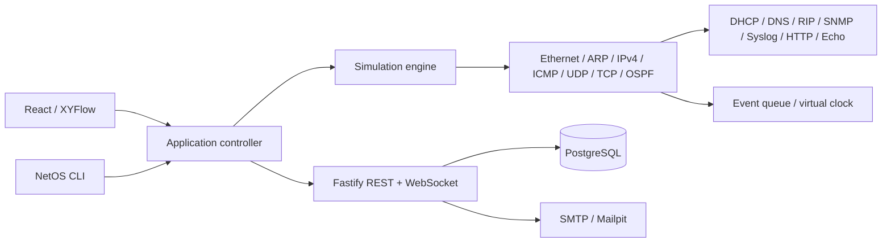

# shLab — arquitetura e escopo

## Entrega

Primeira versão funcional (MVP 1): PC → switch → router → switch → PC, autenticação completa sem RBAC, projetos privados, edição, persistência, export/import e inspeção dos eventos. OSPF e RIPv2 acrescentam roteamento dinâmico educacional; BGP IPv4 acrescenta sessões TCP, eBGP/iBGP, políticas e reflexão; SD-WAN, wireless e os demais serviços atuais estão descritos nos ADRs e na matriz de cobertura.

A primeira fatia do MVP 2 adiciona UDP/DHCPv4, com cliente, servidor e relay separados, pools locais/remotos, reservas por MAC, concessões e temporizadores virtuais. ARP possui resoluções serializáveis e retries limitados. CLI, formulários e importação consomem as mesmas regras do motor.

## Decisões

- Monorepo npm/TypeScript, React + Vite + XYFlow, Fastify e PostgreSQL. SPA adequada ao editor, sem complexidade de SSR.
- Motor TypeScript puro sem React, DOM, banco ou relógio real. O canvas é adaptador do domínio.
- Eventos discretos serializáveis ordenados por tempo virtual e sequência. PRNG com seed e limites de filas/hops/histórico.
- Engine organizado em núcleo, dispositivos, links, Ethernet, ARP, IPv4, UDP, cliente/servidor DHCP e CLI; nenhum shell ou firmware real.
- Simulação interativa local por usuário. API persiste snapshots validados e versionados com concorrência otimista. A avaliação de labs usa uma cópia isolada e limitada do motor no backend, conforme ADR-008. WebSocket notifica alterações de projeto autenticadas; não transmite frames efêmeros.
- A execução contínua usa Worker com gerações e deltas. Editar configuração ou gerar novo tráfego pausa a execução e invalida respostas antigas; Executar simulação retoma a partir do estado atualizado. Pan/zoom não pausam a simulação.
- PostgreSQL JSONB armazena o agregado atômico de topologia, interfaces, links, configuração e simulação. Usuários, sessões, tokens e projetos são relacionais.
- Autenticação e-mail/senha: Argon2id, tokens opacos hashados, cookies HttpOnly/SameSite, expiração/revogação, CSRF/origem, verificação e reset por SMTP ou Resend HTTPS. Sem administração de usuários, organizações ou SSO.

## Domínio

Device possui interfaces, VLANs, cache ARP, tabela MAC, rotas, contadores, logs e estados opcionais de serviços, roteamento dinâmico e políticas. Interface possui MAC, endereço/prefixo, estado administrativo, mídia, MTU, modo access/trunk/routed e VLANs. Link une duas interfaces com latência, perda e distância. Frame encapsula ARP, BPDU ou IPv4; Packet discrimina ICMP, UDP, TCP e OSPF. UDP transporta DHCP/DNS/RIP/SNMP/syslog tipados. Event tem tempo virtual, tipo, origem, destino, interface, frame e explicação. Simulation contém seed, relógio, fila, estado e resultados de probes e consultas.

## Milestones

1. Foundation, contratos, validação, banco, segurança, CI e documentação.
2. Motor, aprendizado/aging MAC, ARP, ICMP, VLANs, roteamento, falhas e testes.
3. Autenticação completa, CRUD privado, versões, import/export.
4. Canvas, conexões por porta, configurações, CLI, timeline, animação e inspector.
5. Integração inter-subnet, isolamento, regressões e E2E.

## Riscos

- Loops L2: STP/RSTP por BPDUs e árvore comum, com orçamento de hops/eventos ainda ativo para configurações inválidas ou protocolo desabilitado.
- Explosão de eventos: limites explícitos e processamento em batches.
- Divergência UI: engine é fonte única; rendering separado do relógio.
- Saves inconsistentes: snapshot inclui fila, relógio, seed, tabelas; JSONB atômico e revisão.
- Inputs malformados: Zod estrito e invariantes referenciais na API e no import.
- Escala: índices por ID/porta, Worker com deltas e limites explícitos; renderização por viewport e visão simplificada de grandes topologias.

## Limites deliberados

O motor usa transporte e controle locais à topologia: TCP com janela/congestionamento/RTO, IPv4 fragmentado, IPv6/DHCPv6/NUD, ACL/NAT/hairpin/SIP ALG e firewall/IDS. OSPF/RIP/BGP instalam rotas usadas pelos dados; PVST/MSTP e LACP negociam encaminhamento L2. DNSSEC/EDNS, SIP/RTP, IPP, MQTT, proxy/balanceador e hardware serial/console/PoE mantêm estado e timers persistidos. WLC/CAPWAP e mesh transportam Ethernet; PEAP/TLS, VPN e gerenciamento usam criptografia real com PDUs/certificados tipados. A aplicação não emula Internet, firmware ou interoperabilidade binária completa. Limites e decisões estão nos ADRs 029–034.

Os ADRs 024–028 documentam QoS/MPLS, VXLAN/EVPN, 802.1X/AAA/inspeção de aplicação, automação/telemetria/NTP e catálogo/análise/labs. Estados opcionais preservam compatibilidade com snapshots anteriores. Cada capacidade configura o mesmo motor; os painéis não calculam respostas de protocolo.

A aprendizagem combina definições declarativas de desafios, avaliação isolada no servidor, melhor pontuação e tutorial sequencial. Os dados ficam associados ao projeto privado; verificação não aceita código nem pontos do cliente. Migrations 004/005 e OpenAPI cobrem os contratos. Histórico privado e rate limits compartilhados usam 006/007.
